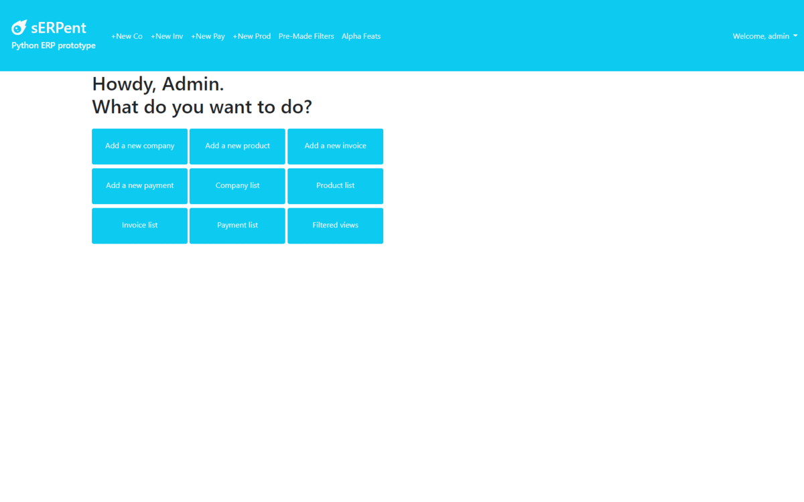

  [](https://makeapullrequest.com)

# sERPent - A Django ERP prototype
Creating an Enterprise Resource Planner (ERP) software that may helps me managing my company. Currently WIP.

## Environment setup and quick-start

**About my prod env:** code has been build and tested on Django 4.0.2 and Python 3.8.8 running on Win11 machine.

1. Clone the project: `git clone https://github.com/carloocchiena/django_erp.git`.
2. Create a virtual environment (conda `conda create -n my_env pip python=3.8`) (python `python3 -m venv my_env`).
3. Activate your virtual environment: (conda`conda activate my_env`) (Linux/MacOS `source my_env/bin/activate`) (Windows `source my_env/Scripts/activate`).
4. Install requirements.txt: `pip install -r requirements.txt`.
5. Create a `.env` file with your SECRET KEY
6. Navigate to the ``erp` folder you want.
7. Make migrations with: `python manage.py makemigrations` and apply them with  `python manage.py migrate`.
8. Let's start the engine with `python manage.py runserver`.
9. Have fun! :)

###Use docker-compose
```docker-compose up django_erp```


## Business Logic

The underlying idea is being able to quickly create templates for Companies and Products and cloning them upon necessity.
Payments and Invoices are expected to be inserted from time to time.
The filtered views allow to have a quick overview of how's the business going, specifically having in mind the daily checks you have to perform on outstanding credits and debits and invoices. 
I may be willing to extend reporting features a bit, it depends from the free time I have to allocate on this project. 

## Testing

To run the automated test, input `python manage.py test --parallel auto --verbosity=2`.
Use predefined docker-compose service if docker is available:
```docker-compose  -f docker-compose.test.yaml run --rm  django_erp_tests```

At the moment there are more near 100 test cases, covering from models, to forms, to views, and their underlying logics.

## Frontend

I took a personal challenge in tryin to do the whole project with Bootstrap 5, without using CSS stylesheet (that is in fact just made up of 3 row of code).

## Example screenshots



## Features

List of all the available feature as per 14 Sept 2022

<strong>Data entry</strong>
    <li>Create a new user (backend only)</li>
    <li>Create a new user group (backend only)</li>
    <li>Create a new company</li>
    <li>Create a new product</li>
    <li>Create a new invoice</li>
    <li>Create a new payment</li>
    <li>Update a company</li>
    <li>Update a product</li>
    <li>Update an invoice</li>
    <li>Update a payment</li>
    <li>Clone a company</li>
    <li>Clone a product</li>
    <li>Clone an invoice</li>
    <li>Clone a payment</li>

<strong>Automations</strong>
    <li>Private Web APIs (GET, HEAD, OPTIONS) for the whole dataset</li>
    <li>Unit testing </li>
    <li>See a list of all the companies, with dynamic filters and CSV export</li>
    <li>See a list of all the products, with dynamic filters and CSV export</li>
    <li>See a list of all the invoices, with dynamic filters and CSV export</li>
    <li>Automatically update product quantity for each invoice and flag refill needed if quantity is under a given threshold</li>
    <li>Report open credits position</li>
    <li>Report open debits position</li>
    <li>Report all active invoices </li>
    <li>Report all active payments </li>
    <li>Report all passive invoices </li>
    <li>Report overdue active invoices </li>
    <li>Report overdue passive invoices </li>

## Walkthrough
I created also some additional walktrought that should help you configuring your Django project:<br>
[The django walkthrough](django_walktrought.md).<br>
[A list of useful commands](CLI_commands.md).<br>

## Contribute
Every feedback and contribution is welcome.
Please just:
1. Open an issue and discuss the changes you'd like to make or  the bug\issue you'd like to report.<br>
2. Once ready to submit a pull request, provide proof of the testing you've done.<br>
